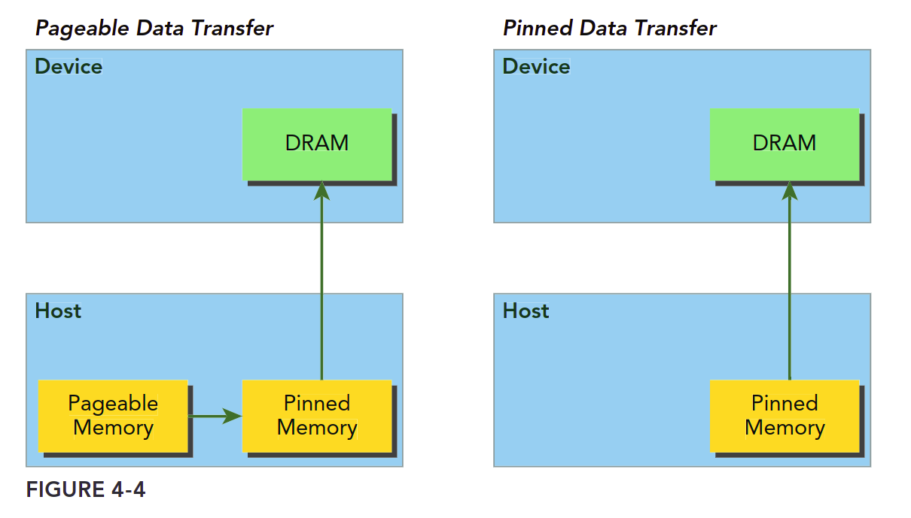

### Pinned Memory

**Allocated host memory is by default pageable**, that is, subject to page fault operations that move data in host virtual memory to different physical locations as directed by the operating system. Virtual memory offers the **illusion**(错觉) of much more main memory than is physically available, just as the L1 cache offers the illusion of much more on-chip memory than is physically available.

The GPU cannot safely access data in pageable host memory **because it has no control over when the host operating system may choose to physically move that data**. When transferring data from pageable host memory to device memory, the CUDA driver first allocates temporary page-locked or pinned host memory, copies the source host data to pinned memory, and then transfers the data from pinned memory to device memory, as illustrated on the left side of Figure 4-4.



The CUDA runtime allows you to directly allocate pinned host memory using:

```c
cudaError_t cudaMallocHost(void **devPtr, size_t count);
```

This function allocates `count` bytes of host memory that is page-locked and accessible to the device. Since **the pinned memory can be accessed directly by the device**, it can be read and written with much higher bandwidth than pageable memory. However, allocating excessive amounts of pinned memory might degrade host system performance, since it reduces the amount of pageable memory available to the host system for storing virtual memory data.

The following code snippet demonstrates allocating pinned host memory with error checking and elementary error handling:

```c
cudaError_t status = cudaMallocHost((void**)&h_aPinned, bytes);
if (status != cudaSuccess)
{
    fprintf(stderr, "Error returned from pinned host memory allocation\n");
    exit(1);
}
```

Pinned host memory must be freed with:

```c
cudaError_t cudaFreeHost(void *ptr);
```

